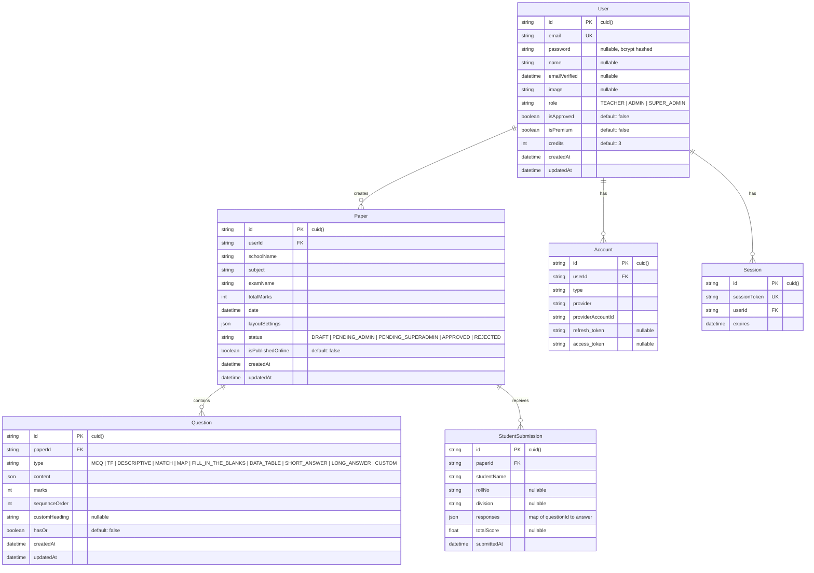

# ExamCraft Pro — Technical Architecture Document

> **Version:** 1.0  
> **Date:** August 27, 2026  
> **Author:** ExamCraft Pro Team  
> **Status:** Living Document

---

## 1. Architecture Overview

ExamCraft Pro follows a **monolithic Next.js App Router** architecture deployed on a **Hostinger VPS** with **PM2** process management. The application uses **server-side rendering (SSR)** for authenticated dashboard pages and **client-side rendering (CSR)** for interactive components like the Paper Builder.

```
┌──────────────────────────────────────────────────────────────────┐
│                        CLIENT (Browser)                          │
│  ┌─────────────┐  ┌─────────────┐  ┌──────────────────────────┐ │
│  │  Landing     │  │  Auth       │  │  Dashboard (SSR + CSR)   │ │
│  │  Page        │  │  (Login/    │  │  ┌─────────────────────┐ │ │
│  │             │  │  Register)  │  │  │ Paper Builder (CSR) │ │ │
│  └─────────────┘  └─────────────┘  │  │ Admin Panel (SSR)   │ │ │
│                                     │  │ Settings (CSR)      │ │ │
│                                     │  │ Reports (SSR+CSR)   │ │ │
│                                     │  └─────────────────────┘ │ │
│                                     └──────────────────────────┘ │
└─────────────────────────────┬────────────────────────────────────┘
                              │ HTTPS
┌─────────────────────────────▼────────────────────────────────────┐
│                     NEXT.JS SERVER (Node.js 20)                  │
│  ┌───────────────────────────────────────────────────────────┐   │
│  │                   API Routes (/api/*)                      │   │
│  │  ┌──────────┐ ┌──────────┐ ┌──────────┐ ┌─────────────┐  │   │
│  │  │ Auth     │ │ Paper    │ │ AI       │ │ Admin       │  │   │
│  │  │ NextAuth │ │ CRUD     │ │ Parse    │ │ Users       │  │   │
│  │  │ Register │ │ Save     │ │ Variant  │ │ Papers      │  │   │
│  │  │          │ │ Publish  │ │          │ │ Status      │  │   │
│  │  │          │ │ Submit   │ │          │ │             │  │   │
│  │  └──────────┘ └──────────┘ └──────────┘ └─────────────┘  │   │
│  └───────────────────────────────────────────────────────────┘   │
│                              │                                    │
│  ┌───────────────────────────▼───────────────────────────────┐   │
│  │                    Prisma ORM Layer                         │   │
│  └───────────────────────────┬───────────────────────────────┘   │
└──────────────────────────────┼───────────────────────────────────┘
                               │
┌──────────────────────────────▼───────────────────────────────────┐
│                     MySQL Database                                │
│     (PlanetScale-compatible / Hostinger MySQL)                    │
│  ┌─────────┐ ┌─────────┐ ┌─────────┐ ┌──────────────────────┐   │
│  │  User   │ │  Paper  │ │Question │ │ StudentSubmission    │   │
│  │  Account│ │         │ │         │ │                      │   │
│  │  Session│ │         │ │         │ │                      │   │
│  └─────────┘ └─────────┘ └─────────┘ └──────────────────────┘   │
└──────────────────────────────────────────────────────────────────┘
                               │
┌──────────────────────────────▼───────────────────────────────────┐
│                   External Services                               │
│  ┌─────────────────────────┐  ┌───────────────────────────────┐  │
│  │  Google Gemini AI       │  │  Google OAuth 2.0              │  │
│  │  (gemini-2.5-flash)     │  │  (Sign-in provider)            │  │
│  └─────────────────────────┘  └───────────────────────────────┘  │
└──────────────────────────────────────────────────────────────────┘
```

---

## 2. Technology Stack

| Layer | Technology | Version | Purpose |
|-------|-----------|---------|---------|
| **Framework** | Next.js (App Router) | 16.1.6 | Full-stack React framework |
| **Runtime** | Node.js | 20 LTS | Server runtime |
| **Language** | TypeScript | 5.x | Type-safe development |
| **UI Library** | React | 19.2.3 | Component rendering |
| **Styling** | Tailwind CSS | 4.x | Utility-first CSS |
| **UI Components** | Radix UI + shadcn/ui | Latest | Accessible component primitives |
| **ORM** | Prisma | 5.10.0 | Database access & migrations |
| **Database** | MySQL | 8.x | Primary data store |
| **Auth** | NextAuth.js | 4.24.13 | Authentication & sessions |
| **AI** | Google Gemini (`@google/genai`) | 1.42.0 | Question parsing & variant generation |
| **PDF Generation** | jsPDF + jspdf-autotable | Latest | Answer key & OMR sheet generation |
| **DOCX Generation** | docx.js | 9.5.3 | Microsoft Word export |
| **Math Rendering** | KaTeX + react-latex-next | Latest | LaTeX formula rendering |
| **Document Parsing** | Mammoth.js | 1.11.0 | DOCX text extraction |
| **Form Handling** | React Hook Form + Zod | Latest | Form validation |
| **Notifications** | Sonner | 2.0.7 | Toast notifications |
| **Date Handling** | Day.js | 1.11.20 | Date formatting |
| **Icons** | Lucide React | 0.575.0 | Icon library |
| **Process Manager** | PM2 | Latest | Production process management |
| **CI/CD** | GitHub Actions | N/A | Automated deployment |

---

## 3. Database Schema (ERD)



---

## 4. API Route Architecture

### 4.1 Authentication Routes

| Method | Path | Auth | Description |
|--------|------|------|-------------|
| POST | `/api/auth/register` | Public | Email/password registration (bcrypt hashed) |
| GET/POST | `/api/auth/[...nextauth]` | Public | NextAuth.js handler (Credentials + Google OAuth) |

### 4.2 Paper Management Routes

| Method | Path | Auth | Description |
|--------|------|------|-------------|
| POST | `/api/paper/save` | Session | Create new paper with questions (transaction) |
| GET | `/api/paper/[id]` | Session + Owner/Admin | Fetch paper with ordered questions |
| PUT | `/api/paper/[id]` | Session + Owner/Admin | Update paper (delete-all + re-create questions in transaction) |
| DELETE | `/api/paper/[id]` | Session + Owner/Admin | Delete paper (cascade deletes questions) |
| POST | `/api/paper/[id]/publish` | Session + Owner/Admin | Toggle `isPublishedOnline` status |
| POST | `/api/paper/[id]/submit` | Public | Student test submission with auto-grading |

### 4.3 AI Routes

| Method | Path | Auth | Cost | Description |
|--------|------|------|------|-------------|
| POST | `/api/ai/parse` | Session + Credits | 1 credit | Parse text/PDF/DOCX/images into structured questions |
| POST | `/api/ai/variant` | Session + Credits | 1 credit | Generate anti-cheat variant (Set B, C, etc.) |

### 4.4 Admin Routes

| Method | Path | Auth | Description |
|--------|------|------|-------------|
| POST | `/api/admin/users/approve` | Admin/SuperAdmin | Approve pending user accounts |
| POST | `/api/admin/papers/status` | Role-based | Update paper status (with role-specific transition rules) |

### 4.5 Billing Routes

| Method | Path | Auth | Description |
|--------|------|------|-------------|
| POST | `/api/user/credits` | Session | Add credits + mark user as premium |

---

## 5. AI Integration Architecture

### 5.1 Model & Provider

- **Provider:** Google Generative AI (`@google/genai` SDK)
- **Model:** `gemini-2.5-flash`
- **Response Format:** `application/json` (structured output)

### 5.2 Reliability Pattern

```
Request → Retry Loop (max 3 attempts) → Exponential Backoff
         ↓ (on 503/429)
         Wait 1s → 2s → 4s → Fail
```

- **Retryable errors:** HTTP 503 (Service Unavailable), HTTP 429 (Rate Limit)
- **Non-retryable errors:** All others (propagated immediately)

### 5.3 JSON Safety

The AI parse route includes a custom **JSON escape sanitizer** that:
1. Walks the raw JSON string character-by-character
2. Inside quoted strings, double-escapes invalid JSON escapes (e.g., `\text` → `\\text`)
3. Preserves valid JSON escapes (`\"`, `\\`, `\n`, `\t`, `\uXXXX`)
4. Falls back to sanitized parsing if initial `JSON.parse()` fails

### 5.4 Post-Processing

- **MCQ option cleanup:** Regex strips leading prefixes like `A.`, `(B)`, `iv.`
- **Markdown code block removal:** Strips `\`\`\`json` wrappers from AI output
- **Credit deduction:** Atomic `decrement: 1` on success only, skipped for Admin/SuperAdmin roles

---

## 6. Deployment Architecture

### 6.1 Infrastructure

| Component | Platform | Details |
|-----------|----------|---------|
| **Application Server** | Hostinger VPS | Ubuntu Linux, Node.js 20 LTS |
| **Process Manager** | PM2 | Auto-restart, log management |
| **Database** | MySQL (PlanetScale-compatible) | Managed MySQL instance |
| **CI/CD** | GitHub Actions | Auto-deploy on push to `main` |
| **DNS/SSL** | Hostinger | Domain management + SSL certificates |

### 6.2 CI/CD Pipeline

```mermaid
flowchart LR
    A[Push to main] --> B[GitHub Actions Runner]
    B --> C[Install Dependencies - npm ci]
    C --> D[Build Application - npm run build]
    D --> E[SSH into VPS]
    E --> F[git pull origin main]
    F --> G[npm ci]
    G --> H[prisma generate]
    H --> I[prisma migrate deploy]
    I --> J[npm run build]
    J --> K[PM2 restart examcraft]
```



### 6.3 Environment Variables

| Variable | Purpose | Sensitivity |
|----------|---------|-------------|
| `DATABASE_URL` | MySQL connection string | 🔴 Secret |
| `NEXTAUTH_SECRET` | JWT signing key | 🔴 Secret |
| `NEXTAUTH_URL` | Application base URL | 🟡 Config |
| `GEMINI_API_KEY` | Google AI API key | 🔴 Secret |
| `GOOGLE_CLIENT_ID` | OAuth client ID | 🟡 Config |
| `GOOGLE_CLIENT_SECRET` | OAuth client secret | 🔴 Secret |

---

## 7. Client-Side Architecture

### 7.1 Rendering Strategy

| Page | Rendering | Reason |
|------|-----------|--------|
| Landing (`/`) | SSR (Server Component) | SEO, no auth needed |
| Login/Register | CSR (Client Component) | Form interactivity |
| Dashboard | SSR (Server Component) | Fetch user papers server-side |
| Paper Builder | CSR (Client Component) | Real-time editing, live preview, complex state |
| Admin Portal | SSR (Server Component) | Data fetching, role gate |
| Settings | CSR (Client Component) | Payment interactions |
| Test Page (`/test/[id]`) | SSR → CSR hybrid | SSR fetches paper, CSR handles test-taking |
| Reports | SSR → CSR hybrid | SSR fetches data, CSR renders interactive report |

### 7.2 A4 Pagination Engine

The Paper Builder implements a custom **real-time A4 pagination engine**:

1. **Page Height Limit:** 1040px (A4 at 96dpi minus margins and safety)
2. **Header Height Measurement:** DOM-measured via `useRef` on the header container
3. **Per-Question Height:** Measured via `el.offsetHeight` on rendered question elements
4. **Page Break Logic:** If `currentHeight + elementHeight > PAGE_HEIGHT_LIMIT`, push to next page
5. **Triggers:** Recalculates on any change to questions, metadata, or font loading state

### 7.3 Export Pipeline

```
Questions State → generatePdfViaBrowser() → window.print() → Native PDF
                → generateDocx()          → Packer.toBlob() → FileSaver
                → generateAnswerKeyPdf()   → jsPDF → Blob → FileSaver
                → generateOmrPdf()         → jsPDF → Blob → FileSaver
```

---

## 8. Error Handling Strategy

| Layer | Strategy |
|-------|----------|
| **API Routes** | try/catch with structured JSON error responses and HTTP status codes |
| **AI Routes** | Exponential backoff + user-friendly error messages for 503/429 |
| **Client** | Toast notifications via Sonner for all async operations |
| **Auth** | NextAuth error pages + custom redirect on invalid credentials |
| **Database** | Prisma transactions for multi-table writes (paper + questions) |
